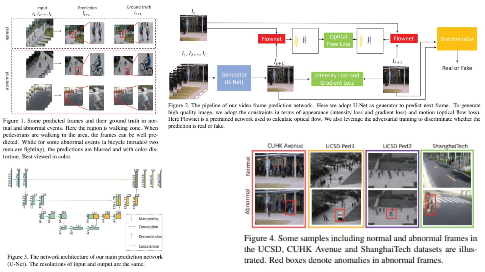

# 🎥 Future Frame Prediction for Video Anomaly Detection

This repository provides a **theoretical PyTorch implementation** of the  
**Future Frame Prediction framework for video anomaly detection**.

The goal is not leaderboard performance, but to **translate the original paper’s ideas into clean, understandable code**, focusing on *why* anomaly detection emerges from prediction failure rather than classification.

- Learning **normal motion and appearance dynamics** from video sequences 🫧  
- Predicting the **next video frame** from past observations 🌒  
- Detecting anomalies via **prediction inconsistency** instead of labels 🧿  
- Loss-driven temporal understanding without explicit temporal models 🧩  

**Paper reference:** [Future Frame Prediction for Anomaly Detection – Wen Liu et al., CVPR 2018](https://arxiv.org/pdf/1712.09867) 🪐


---

## 🌌 Overview – Predict the Future, Expose the Abnormal



The central idea is deceptively simple:

> A model that has only seen *normal futures* will fail when the future becomes abnormal.

Instead of classifying events, the system **predicts what should happen next** and measures how wrong that prediction is.

High error → something unusual is happening.

### Core pipeline (condensed from the paper):

1. Given a sequence of past frames:
   $$X_t = \{x_{t-k}, \dots, x_{t-1}\}$$

2. Predict the next frame using a convolutional encoder–decoder:
   $$\hat{x}_t = G(X_t)$$

3. Compare predicted frame $\hat{x}_t$ with the true future frame $x_t$

4. Compute multiple complementary prediction losses:
   - **Intensity loss** (pixel accuracy)
   - **Gradient loss** (edge & structure consistency)
   - **Optical flow loss** (motion consistency)

5. Combine losses into a single anomaly score:
   $$A_t = \alpha L_{\text{int}} + \beta L_{\text{grad}} + \gamma L_{\text{flow}}$$

During inference:
- Low $A_t$ → normal behavior  
- High $A_t$ → anomaly candidate  

No labels. No classifiers.🔍

---

## 🧠 What the Model Actually Learns

The predictor network learns:

- **Appearance regularities** (what normal frames look like)
- **Motion regularities** (how objects usually move)
- **Temporal smoothness** (what changes are expected vs. suspicious)

Importantly:
- The model is **never told what an anomaly is**
- Anomalies emerge naturally when prediction **breaks down**

Think of it as learning the *grammar* of normal motion — anomalies are grammatical errors 🪶

---

## 🧮 Loss Functions (Paper-Aligned, Short Form)

### 1. Intensity Loss (Eq. 1)
Pixel-wise difference between prediction and ground truth:

$$L_{\text{int}} = \| \hat{x}_t - x_t \|_2$$

Encourages accurate reconstruction of normal frames.

---

### 2. Gradient Loss (Eq. 2)
Difference between spatial gradients:

$$L_{\text{grad}} = \| \nabla \hat{x}_t - \nabla x_t \|_1$$

Preserves edges and structural sharpness, preventing blurry predictions.

---

### 3. Optical Flow Loss (Eq. 3)
Difference between motion fields:

$$L_{flow} = \| F(x^t, x_{t-1}) - F(x_t, x_{t-1}) \|_1$$


Ensures predicted motion matches real motion patterns.

This is where **temporal understanding** truly enters the system 🌊

---

## 🧩 Why No Conv3D or ConvLSTM?

Deliberately avoided.

- Temporal reasoning is enforced **through losses**, not architecture  
- Keeps the model lightweight and interpretable  
- Strengthens the paper’s claim: *prediction failure alone is enough*

This makes the framework a **baseline philosophy**, not a brute-force solution ⚖️

---

## 📦 Repository Structure

```bash
Future-Frame-Prediction-Anomaly/
├── src/
│   ├── layers/
│   │   ├── conv_block.py          # Conv2D + activation
│   │   ├── deconv_block.py        # ConvTranspose2D
│   │   └── utils_layers.py        # weight init, padding helpers
│   │
│   ├── blocks/
│   │   ├── encoder_block.py       # U-Net encoder (downsampling)
│   │   └── decoder_block.py       # U-Net decoder (upsampling + skip)
│   │
│   ├── model/
│   │   ├── future_frame_model.py  # U-Net based future frame predictor
│   │   └── generator.py           # optional wrapper, if needed
│   │
│   ├── losses/
│   │   ├── intensity_loss.py      # L2 pixel loss
│   │   ├── gradient_loss.py       # Gradient loss
│   │   └── optical_flow_loss.py   # Flow consistency loss
│   │
│   └── config.py                  # λ_int, λ_gd, λ_op
│
├── images/
│   └── figmix.jpg
│
├── requirements.txt
└── README.md
```
---


## 🔗 Feedback

For questions or feedback, contact: [barkin.adiguzel@gmail.com](mailto:barkin.adiguzel@gmail.com)
